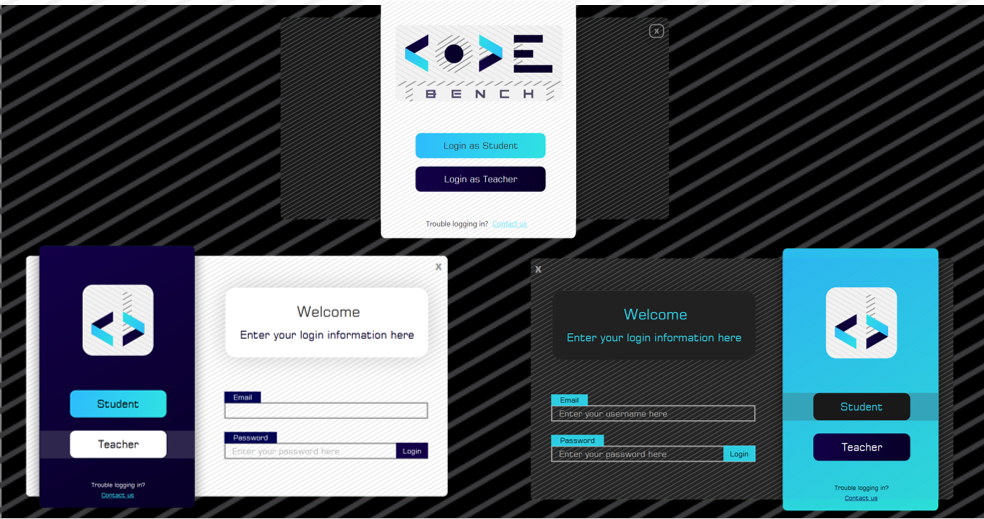
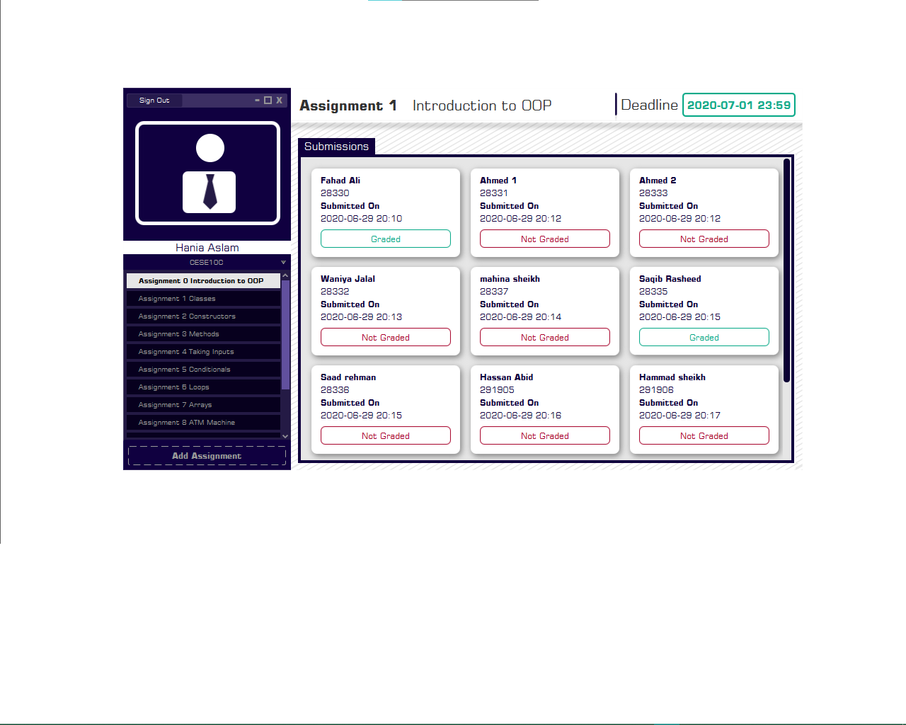
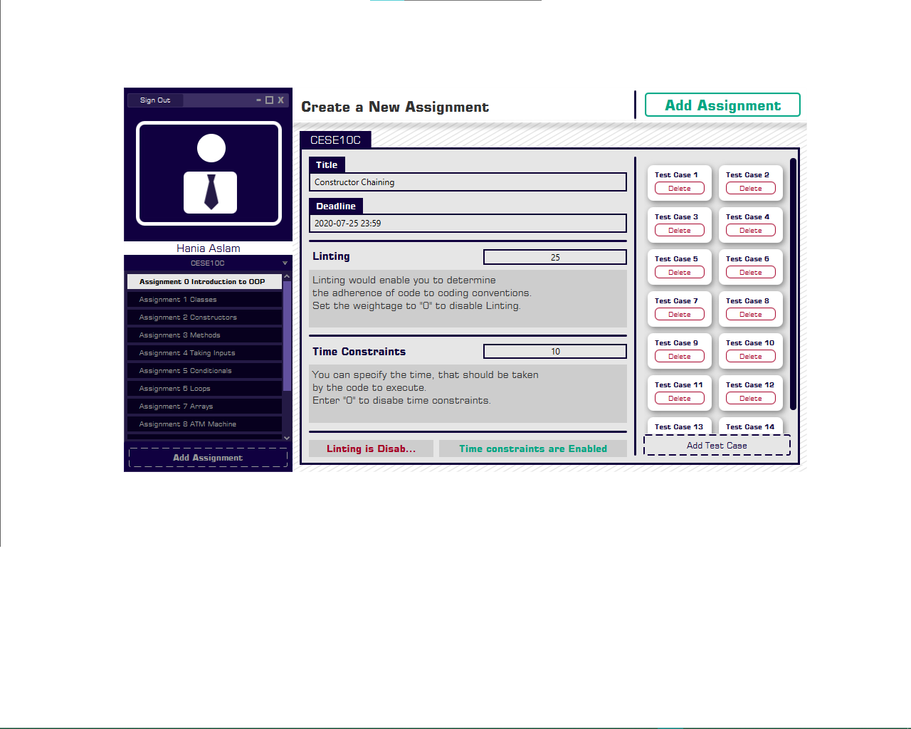
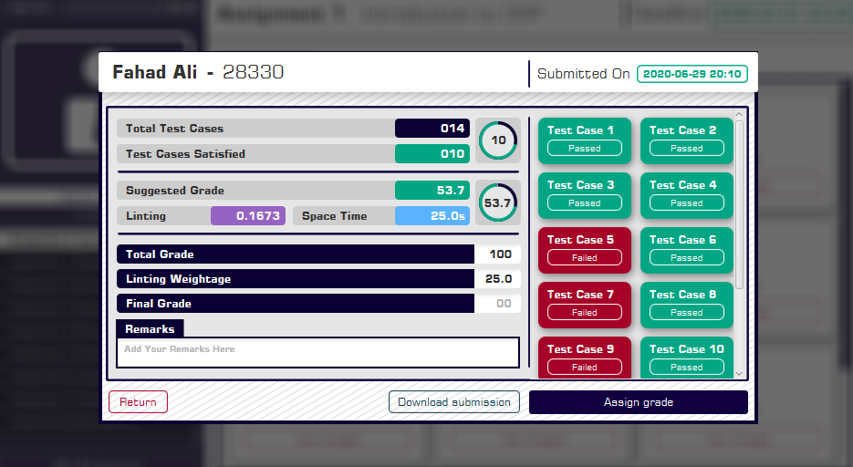
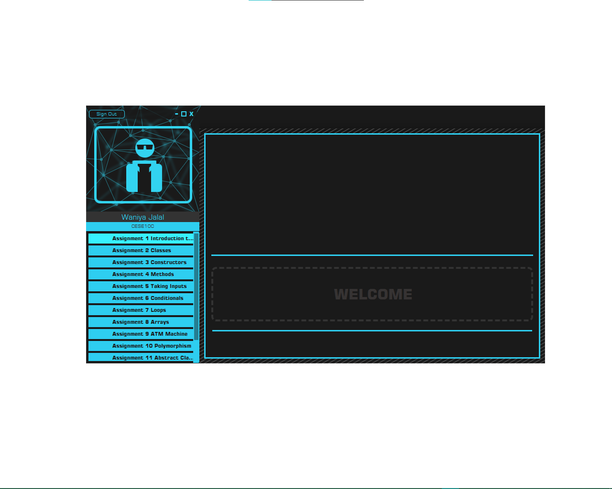
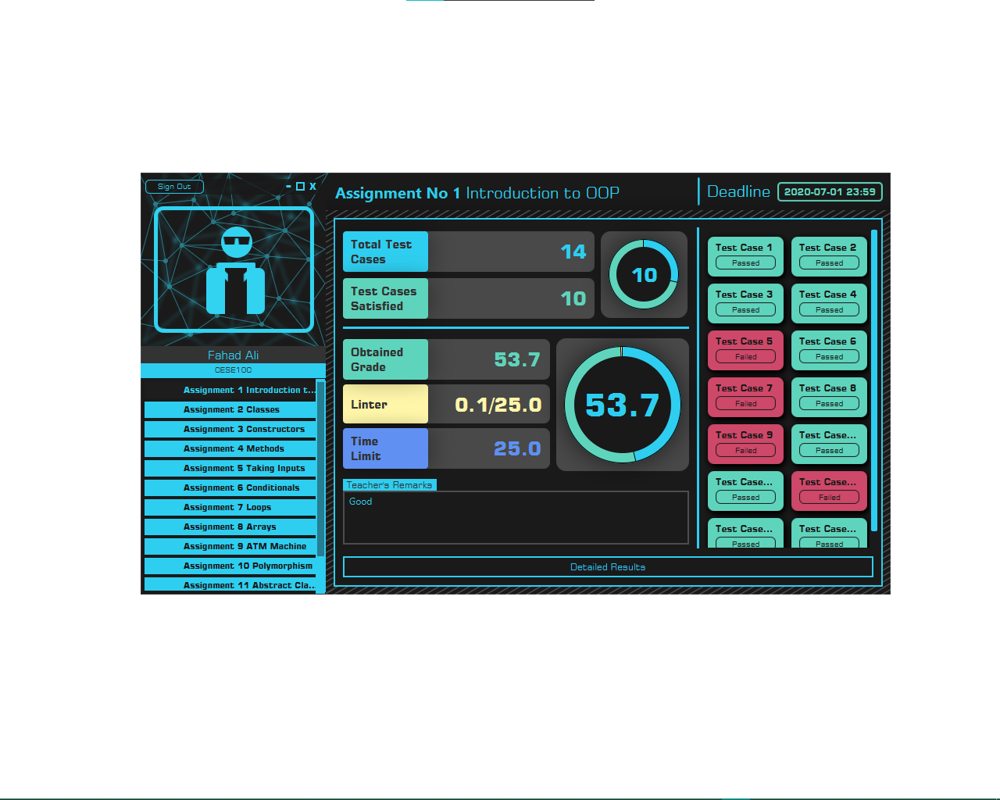

# CodeBench
CodeBench-An automatic grader for programming assignments.

  CodeBench is an application that is capable of automatically grading the programming assignments attempted in python mainly on the basis of the test suite provided by the instructor. The backend has been created with python and frontend comprises of a desktop application created with the most popular GUI framework of Java, JavaFX. Moreover, the instructor can assign weightages to adherence to coding conventions and fulfilment of time constraints.

# Main features and Architecture

As mentioned earlier, CodeBench comprises of a desktop application created using JavaFX on the frontend and a backend created with python.
Flask, a web microframework for python, has been used for the development of robust RESTful APIs and SQLite has been used as database. 
The desktop application communicated with the backend through the consumption of the RESTful APIs.
 Data is transmitted to and from the server in JSON format which is parsed in the frontend and dynamically displayed to the user.
Two separate login portals for teacher and student are maintained with different color schemes. Teacher can create new assignments by specifying the name, deadline,
test suite and weightages for linting and time constraints. In addition to that, teacher can set certain test cases as visible whose results would be immediately displayed
to the student upon submission. Not more than 20% weightage can be assigned to linting and total grade is assigned out of 100.Teacher can also check submissions for the existing assignments, grade them, add remarks and download individual submissions. On the other hand, the student can view assignments for the courses he is enrolled, view assignments and add submissions and view results once they are assigned by the teacher. 

# CodeBench-Desktop

## Libraries and modules used

javafx(GUI framework for JAVA)

java.net(Classes UrlConnection and HttpUrlConnection to perform networking)

org.JSON(Used for JSON parsing and packing the data captured at the frontend in JSON form)

java.time.LocalDateTime(To create DateTime objects to represent and manipulating the deadlines)

java.concurrent(Used to perform multiple threading)

Adobe Creative Suit {Adobe Xd (UI Prototype), Adobe Illustrator (Graphics and Logo design ) and Adobe PhotoShop}

Scene Builder(For placement of static UI elements)

CSS(For applying design to various UI elements)

### Login portals
The student and the instructor have their dedicated login portals where they can login to their respective accounts by entering their email address and password. Authentication is performed at the Backend. Separate color schemes have been designed for the instructor and the student.

## Instructor’s interface

### Viewing assignments and submissions

The instructor can view the assignments assigned by him/he in the courses being taught by him/her.
Details of all the submissions of every individual assignment can be viewed as well.

### Assignment creation

The instructor can create new assignments for the desired course by specifying the name, deadline, weightage for linting, time constraints and the test suite.
Instructor can also specify test cases whose results would be visible to the student at the time of assignment submission.

###	Viewing results

The instructor can view results of every individual which includes the scores for linting, adherence to timing constraints,
overall scores and obtained output of the passed/failed testcases. The instructor assigns the final grade out of 100 and can also give remarks.
Moreover, the submission of every student can also be downloaded and saved in the directory specified by the instructor.

## Student’s interface

### Viewing assignments: -

The student can view assignments for the courses he/she is enrolled in and view his/her submission status alongside the deadlines.

### Viewing results: -

The student can view detailed results of the submission once a grade is assigned by the teacher.

### Concurrency
The issue with javafx is that it is not thread safe. 
The changes in the scene graph can only be made from the main Application thread otherwise an Exception is thrown.
As a results, is networking operations are performed in the main thread, UI becomes non-responsive. In order to solve this problem, 
all the networking operations are performed in a background thread and UI is only updated in the main Application thread so the flow of the application is smooth.
  
  
 
### JSON

The data from the backend is received in the form of JSONArrays and JSONObjects which are parsed all the parsed data is displayed to the user.
The data entered by the user is also packed in JSON form and sent to the server.

# CodeBench-Backend

## Libraries used

Flask: Web Microframework

Marshmallow: Serialization of Database Objects

Flask -JWT: Authentication and Authorization

SQLAlchemy: Object Relational Mapping

PyLint: Measing Code Quality

##Other Modules Used:

subprocess

sendfile

json

Request

Datetime

Pylint

Io

Functools

The server defines API endpoints through which the Desktop app can communicate with it. 
The server responds to the requests by Authorizing the request and then performing the desired operation. We used Flask and its corresponding libraries to achieve that.

### Flask

Flask is a web framework of python which allows us to define our own API end points. 

### Route ()

Route are the decorators that are necessary for the front end to communicate with the server. 
Route takes two arguments one is a string that contains the URL which executes our particular  function and other is the methods 
which is a list that take strings which define the type of Request That is it a POST request or another request  .Now why do we need these decorators? . 
Because the client needs to make a request to do a particular job for instance like in our application when a teacher needs to create an assignment
it sends request to a specific URL of the route which executes that function .There are many routes which allows us to implement  
a lot of functionality in the application ranging from editing assignments to deleting them.

### Flask-JWT-token:
This library handles token generation for us. But what is a token?. Token is necessary for Authentication.
They ensure that the request that has been made for the server is verified. 
In similar words When Client provides correct username and password that particular client is given a token (bunch of characters sort of encrypted password) 
that is necessary fort the client to make request and Token changes after every Login .This ensure the verification of request that each request is accompanied by the token.
This whole process is called token-based Authentication system .There are many functions of JWT:

### get_jwt_identity() 

To get the identity of the JWT like the information such as username and password

###	create_access_token() 

Create token for authentication

###	jwt_required
Decorator used to protect API end point from unauthenticated.

### Json
Many questions arises that how clients sends data like username and password and in which form the data is.
The server receive data in the form of a python dictionary which is called JSON (Java-script Object Notation) Objects.
Client makes request which server gets by using json.request()  .Now the request is in json form which python can ready very easily 
there are many Functions of json that we used

###	Dump
			Used to serialize the given data
      
      
###	Load

Used to deseralize the data.
However we used Dump in our application more oftenly rather than load

###Jsonify()

IT creates a response in JSON form with the given arguments. 
Arguments can be in the form of variables initialization, with key values having name of the variables and values of the variables.

### Sendfile()

When we need to send contents of a file to client we use this function. Like in our application we needed to send contents of the json file for
the final results of student. We used this to send contents.

## PERFORMING CRUD Operations

A large part of the application consists of performing Create, Read, Update and Delete operations on the database. For those purposes, we have employed SQLite as the Database choice for development. In a production environment, it needs to be switched to a fully fledged database service like PostgreSQL or MySQL.
For ease of performing database operations, we used SQLAlchemy as the ORM Library. It integrates nicely with Flask and allows us to make working with the database safer and more convenient.
While performing a READ operation, the data needs to be returned in the form of a JSON object. For easily converting the SQLAlchemy objects to 
JSON based on a predefined schema, we used Marshmallow. It helps us convert complex datatypes (like QuerySets) into native Python datatypes (like dictionaries and lists) so that they can be “jsonified” easily.

### Running a Test

When a submission is received, it needs to be evaluated. This is done in four steps:
a.	In the first step, a Submission record is created for the corresponding assignment and student and an ID is assigned for the submission. The file for the submission is stored on the server.
b.	In the second step, the test cases for the corresponding assignment are assembled from the database. Then the file is run aganist each test case. This is done by spawning a subprocess and communicating the input of the corresponding test case through a PIPE. The output from the subprocess is observed through the ‘stdout’ PIPE. When the program finished, the output is compared with the expected output from the test case. Time constraint is also observed. All of this information helps us determine whether each test case has FAILED or PASSED.
c.	In the third step, static analysis is performed. This is done by running PyLint on the file and calculating a score from the detected warnings and errors. The score is further run through a normalization function to give us a final score. 
d.	Finally, the results from the last two steps are collected and based on the parameters set while creating the assignment, a final score is assigned to the submission. The submission object also store detailed information about the test cases.

Results of test cases that are set visible upon creation of the assignment are shown immediately to the Student while others are kept hidden until the assignment gets Graded.

### Calculating Code Quality Score

Quantizing Code Quality was one of the challenges that we faced during the development of the Backend. We chose PyLint for identifying the styling issues with the code.
PyLint also gives us a score determined using the issues present in the code. Here is the formula for that:
10.0 - ((float(5 * error + warning + refactor + convention) / statement) * 10).
The problem with the above method is quite obvious. The score generated would have an upper bound of 10 but not lower bound. This would mean that the more issues are detected, the score could go down to negative and if multiplied with the weightage, this can actually cause a decrease in the total score. 
That is why we had to use a normalization function to give it both an upper and lower bound. For now, we are using Sigmoid as a temporary patch. The sigmoid function is as follows:
1/(1+e^(-x))
As it can be seen, this gives us a score between 0 and 1, although it has some of its own issues associated with it.

